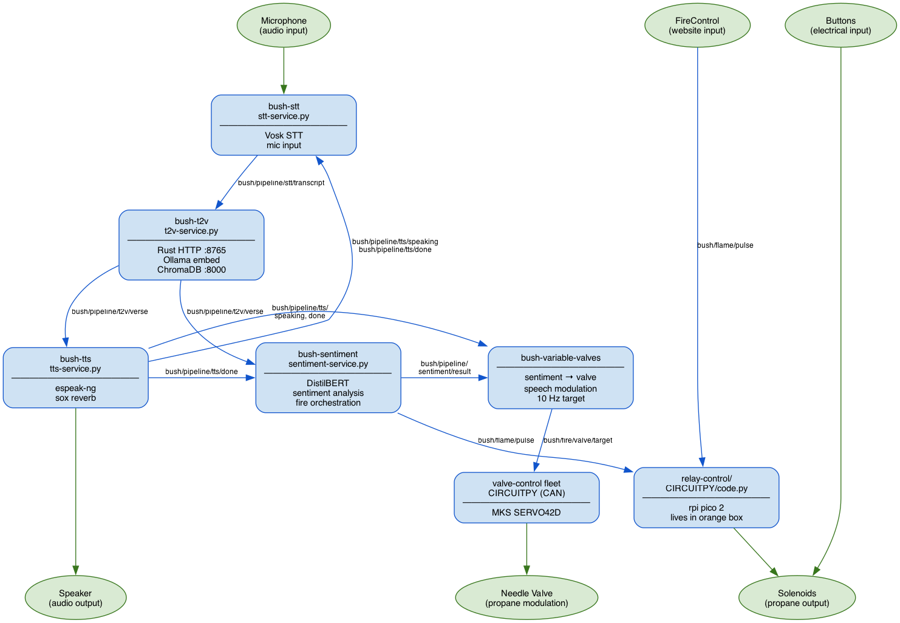

# Bush Glue

Monorepo for the AI Am art installation pipeline. Modular system for critique of intersections of religion and technology.

## Structure

```
services/          Python microservices (uv workspace packages)
  stt/             Speech-to-text (Vosk)
  tts/             Text-to-speech (espeak-ng + sox)
  t2v-bridge/      Text-to-verse MQTT bridge (wraps Rust binary)
  sentiment/       Emotion classification + fire control (DistilBERT)
  sound/           Flame audio synthesis
  audio-agent/     Audio device discovery
  discord/         Discord /pray command bot
packages/          Shared Python packages
  bushutil/        MQTT broker detection, audio config, sox effects
t2v/               Rust text-to-verse server (Cargo project)
data/              Embedding database (Git LFS)
firmware/          CircuitPython relay controller (Pico 2 W)
systemd/odroid/    Systemd service files for ODROID deployment
utils/             CLI tools (monitor, firecontrol, integration test)
docs/              Architecture docs, MQTT topics reference
```

## Architecture



> Source: [`docs/mqtt-architecture.dot`](docs/mqtt-architecture.dot) — regenerate with `dot -Tpng docs/mqtt-architecture.dot -o docs/mqtt-architecture.png`

### Data flow

```
1. Mic audio  →  bush-stt (Vosk)
2. bush-stt   PUB  bush/pipeline/stt/transcript   {text, ts}
3. bush-t2v   SUB  bush/pipeline/stt/transcript  →  HTTP GET localhost:8765/query
                                                     (Ollama embed → ChromaDB lookup)
4. bush-t2v   PUB  bush/pipeline/t2v/verse        {query, text, ts}
5a. bush-tts  SUB  bush/pipeline/t2v/verse  →  espeak-ng + sox reverb  →  speaker
    bush-tts  PUB  bush/pipeline/tts/speaking  at start
    bush-tts  PUB  bush/pipeline/tts/done      at finish
5b. bush-sentiment SUB bush/pipeline/t2v/verse → DistilBERT classify
    bush-sentiment PUB bush/pipeline/sentiment/result
    bush-sentiment PUB bush/flame/pulse  {valve,ms}  (loop until bush/pipeline/tts/done)
6. bush-stt    SUB  bush/pipeline/tts/speaking  →  mute mic
   bush-stt    SUB  bush/pipeline/tts/done      →  unmute + reset Vosk
```

Steps 5a and 5b run in parallel from the same `t2v/verse` message.
The fire loop in bush-sentiment is bounded by `tts/done` or a 30 s timeout.

### MQTT topics

#### Pipeline

| Topic | Publisher | Subscribers |
|-------|-----------|-------------|
| `bush/pipeline/stt/transcript` | bush-stt | bush-t2v |
| `bush/pipeline/stt/partial` | bush-stt | (monitor/discord) |
| `bush/pipeline/t2v/processing` | bush-t2v | (monitor/discord) |
| `bush/pipeline/t2v/verse` | bush-t2v | bush-tts, bush-sentiment |
| `bush/pipeline/tts/speaking` | bush-tts | bush-stt |
| `bush/pipeline/tts/done` | bush-tts | bush-stt, bush-sentiment |
| `bush/pipeline/sentiment/result` | bush-sentiment | (monitor/discord) |
| `bush/pipeline/stt/force-finalize` | (external) | bush-stt |

#### Fire control

| Topic | Publisher | Subscribers |
|-------|-----------|-------------|
| `bush/flame/pulse` | bush-sentiment, bush-firecontrol, bush-firecontrol-web | relay-control, sound-service |

See [docs/README.md](docs/README.md) for audio topics, message payloads, timing constants, and fire patterns.

## Setup

```bash
# Install uv (once)
curl -LsSf https://astral.sh/uv/install.sh | sh

# Install all Python dependencies
uv sync --all-packages

# Build the Rust text-to-verse server
cd t2v && cargo build --release

# Extract chroma embedding database
cd data && tar xzf chroma.tar.gz
```

## Running services

Each service has an entry point in the venv:

```bash
.venv/bin/bush-stt
.venv/bin/bush-tts
.venv/bin/bush-t2v
.venv/bin/bush-sentiment
.venv/bin/bush-sound
.venv/bin/bush-audio-agent
.venv/bin/bush-discord
.venv/bin/chroma run --path data/chromadb
```

## Deploy to ODROID

```bash
git push origin main
ssh odroid 'cd ~/bushglue && git pull && uv sync --all-packages'
ssh odroid 'sudo cp ~/bushglue/systemd/odroid/*.service /etc/systemd/system/ && sudo systemctl daemon-reload'
ssh odroid 'sudo systemctl restart bush-stt bush-tts bush-t2v bush-sentiment bush-audio-agent'
```

## Detailed docs

See [docs/README.md](docs/README.md) for audio management topics, message payloads, timing constants, and emotion-to-fire patterns.
